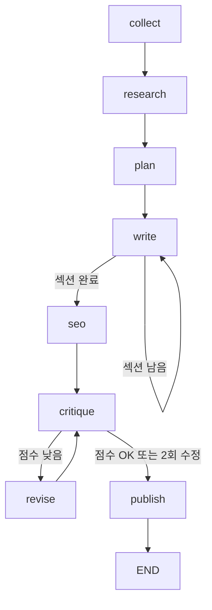

# LangGraph 구조 이해 가이드 (이 프로젝트 기준)

이 문서는 `/home/jiwoonkim/jiwoon/velog_agent_openai` 코드베이스를 기준으로 **LangGraph의 구조와 실행 흐름**을 학습할 수 있도록 정리한 가이드입니다.

---

**이 버전에서 추가된 것**
- 실제 코드 라인 참조
- 다이어그램(mermaid)

---

## 1) 다이어그램으로 보는 전체 흐름



---

## 2) 핵심 파일 지도 (라인 참조)

- 그래프 구성: `app/graph.py` (라인 1–92)
- 상태 정의: `app/state.py` (라인 1–39)
- 노드 구현: `app/nodes/*.py`
- 실행 진입점: `app/main.py` (라인 1–200)

---

## 3) 상태(State) 구조 이해

파일: `app/state.py` (라인 1–39)

LangGraph는 **공유 상태(State)** 를 중심으로 동작합니다. 이 프로젝트에선 `BlogState`가 그 역할을 합니다.

핵심 필드 예시:
- `topic`, `rss_items`, `topic_reason` → 주제 선택 결과
- `research_results`, `references` → 리서치 결과
- `outline`, `seo_keywords` → 목차/키워드
- `sections`, `draft` → 본문 작성 결과
- `critique`, `quality_score`, `revision_count` → 품질 평가/수정
- `final_draft`, `velog_url`, `is_published` → 최종 결과
- `logs` → 단계별 로그 누적

**중요한 포인트**
- `Annotated[list, operator.add]`가 붙은 필드는 **노드 실행 결과가 누적**됩니다.
  - 예: `research_results`, `sections`, `logs`

---

## 4) 그래프 구조 상세

파일: `app/graph.py`

### 4.1 노드 등록 (라인 39–47)
```python
graph.add_node("collect",  collect_and_select_topic)
graph.add_node("research", research)
graph.add_node("plan",     plan)
graph.add_node("write",    write)
graph.add_node("seo",      seo_optimize)
graph.add_node("critique", critique)
graph.add_node("revise",   revise)
graph.add_node("publish",  publish)
```

### 4.2 라우터(조건 분기)

#### writing_router (라인 13–19)
```python
if len(sections) < len(outline):
    return "write_more"
return "seo"
```
- 섹션 수가 모자라면 `write`가 반복됩니다.

#### quality_router (라인 22–31)
```python
if score >= 7 or revision_count >= 2:
    return "publish"
return "revise"
```
- 점수가 낮으면 `revise`로 돌아갑니다.
- 점수가 충분하거나 수정 횟수가 2회를 넘으면 `publish`로 이동합니다.

### 4.3 엣지 연결 (라인 63–84)
```python
graph.set_entry_point("collect")
graph.add_edge("collect",  "research")
graph.add_edge("research", "plan")
graph.add_edge("plan",     "write")

graph.add_conditional_edges(
    "write", writing_router,
    {"write_more": "write", "seo": "seo"}
)

graph.add_edge("seo", "critique")

graph.add_conditional_edges(
    "critique", quality_router,
    {"revise": "revise", "publish": "publish"}
)

graph.add_edge("revise",  "critique")
graph.add_edge("publish", END)
```

---

## 5) 노드별 역할 요약 (라인 참조 포함)

### 5.1 collect (`app/nodes/n1_collect.py` 라인 19–93)
- 사용자 입력 topic이 있으면 RSS를 건너뜀 (라인 28–36)
- 없으면 RSS 수집 → LLM이 주제 선정 (라인 38–92)

### 5.2 research (`app/nodes/n2_research.py` 라인 17–90)
- 검색 쿼리 3개 생성 (라인 28–47)
- Tavily 검색 실행 (라인 48–68)
- 검색 결과 요약 후 `research_results`에 누적 (라인 70–89)

### 5.3 plan (`app/nodes/n3_plan.py` 라인 16–72)
- SEO 키워드 + 목차 설계

### 5.4 write (`app/nodes/n4_write.py` 라인 16–65)
- 섹션 1개씩 작성 (라인 28–65)
- 모든 섹션 완료 시 draft 조합 (라인 28–35)

### 5.5 seo (`app/nodes/n5_seo.py` 라인 16–75)
- SEO 제목, 메타 디스크립션, 태그 생성

### 5.6 critique (`app/nodes/n6_n7_n8.py` 라인 23–76)
- 초안 평가, 점수 산정

### 5.7 revise (`app/nodes/n6_n7_n8.py` 라인 81–118)
- 개선점 반영하여 재작성

### 5.8 publish (`app/nodes/n6_n7_n8.py` 라인 123–180)
- `AUTO_PUBLISH=true` → Velog 발행
- `AUTO_PUBLISH=false` → `drafts/`에 저장

---

## 6) 실행 진입점 이해

파일: `app/main.py`

### 6.1 /generate 엔드포인트 (라인 116–142)
- 한 번의 요청으로 전체 그래프 실행
- 결과 최종 상태 반환

### 6.2 /stream 엔드포인트 (라인 145–172)
- SSE로 노드 완료 이벤트 스트리밍
- 각 노드 완료 시 로그 전달

### 6.3 /history 엔드포인트 (라인 175–193)
- 체크포인트에 저장된 이전 실행 결과 조회

---

## 7) 학습을 위한 실험 포인트

1. `quality_router` 기준을 바꾸어 반복 횟수 실험
2. `write` 노드의 섹션 길이 기준(400~600자)을 조정
3. `/stream`으로 실시간 실행 흐름 확인
4. `Annotated[list, operator.add]`가 누적 상태에 주는 영향 관찰

---

## 8) LangGraph 핵심 개념 요약

- **State(상태)**  
  그래프 전체가 공유하는 단일 데이터 구조. 노드의 입력/출력이 모두 State로 들어오고, 노드는 필요한 값만 읽어서 새 값을 반환합니다.  
  이 프로젝트에서는 `BlogState`가 그 역할을 하며 `app/state.py` (라인 1–39)에 정의되어 있습니다.

- **Node(노드)**  
  한 번의 작업 단위. 입력은 State, 출력은 State에 병합될 dict.  
  예: `collect`, `research`, `plan`, `write`, `seo`, `critique`, `revise`, `publish`  
  각각의 구현은 `app/nodes/*.py`에 있습니다.

- **Edge(엣지)**  
  노드 간 실행 순서 연결. 기본 흐름을 정의합니다.  
  연결 정의는 `app/graph.py` (라인 63–84).

- **Router(조건 분기)**  
  현재 State에 따라 다음 노드를 선택하는 함수.  
  이 프로젝트에서는 `writing_router`와 `quality_router`가 이를 담당합니다.  
  (라인 13–31)

- **Graph(그래프)**  
  노드/엣지/라우터가 조합된 실행 계획.  
  `build_graph()`에서 구성 (라인 36–86)

---

## 9) 체크포인트(Checkpoint) 이해

LangGraph는 **체크포인트 저장소**를 통해 실행 결과를 저장하고, 세션별 상태를 조회할 수 있습니다.  
이 프로젝트에서는 **메모리 기반 체크포인트**를 사용합니다.

- 설정 위치: `app/graph.py` (라인 91–92)
  ```python
  checkpointer = MemorySaver()
  agent_app = build_graph().compile(checkpointer=checkpointer)
  ```

- 의미:
  - `MemorySaver()`는 **프로세스 메모리에 상태를 저장**합니다.
  - 서버가 재시작되면 저장된 상태는 사라집니다.

- 실제 활용:
  - `/history/{session_id}` 엔드포인트가 **체크포인트에 저장된 State**를 조회합니다.  
    (`app/main.py` 라인 175–193)

- 세션 구분 방식:
  - `thread_id`를 세션 키로 사용합니다.  
    (`app/main.py` 라인 123–124, 151–152)

---

필요하면 이 문서에
- “LangGraph 핵심 개념 요약(노드/엣지/라우터/상태)” 섹션
- “LangGraph 체크포인트 설명” 섹션
- “직접 실습 과제” 섹션

까지 추가로 확장해줄게요.
